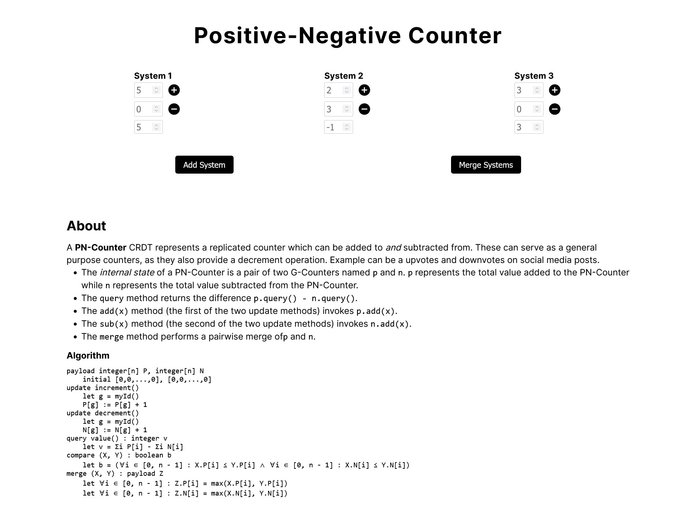

# CRDT Illustrations

CRDTs (Conflict-free Replicated Data Types) are distributed data structures that enable collaborative editing and synchronization without the need for centralized coordination, ensuring eventual consistency across different replicas.

In this project, my aim is to visually illustrate the workings of CRDTs. For that I have covered four basic CRDTs here:

1. [G-Counter](https://crdt-illustration.vercel.app/gcounter)
2. [PN-Counter](https://crdt-illustration.vercel.app/pncounter)
3. [G-Set](https://crdt-illustration.vercel.app/gset)
4. [2P-Set](https://crdt-illustration.vercel.app/twopset)

## Screenshots

## Tech Stack

The web app is built using [React](https://reactjs.org/) and [Next.js](https://nextjs.org/). And testing is done using [Jest](https://jestjs.io/). Vanilla CSS is used for styling, with some components from [Material UI](https://mui.com/) .

The hosted version of the app is deployed on [Vercel](https://vercel.com/) and can be accessed [here](https://crdt-illustration.vercel.app/).

## References

- Jest - Simple tests are slow on [Stack Overflow](https://stackoverflow.com/a/72294484)

- [@swc/jest](https://swc.rs/docs/usage/jest)

- Object.is() on [MDN](https://developer.mozilla.org/en-US/docs/Web/JavaScript/Reference/Global_Objects/Object/is)

- [useSyncExternalStore](https://react.dev/reference/react/useSyncExternalStore)

- [React 18's New State Hook You've Never Heard About](https://www.youtube.com/watch?v=GMeQ51MCegI)

## CRDT References/Citations

- CRDT algorithms from [CRDT's wikipedia page](https://en.wikipedia.org/wiki/Conflict-free_replicated_data_type)

- CRDT descriptions from [Michael Whittaker ](https://mwhittaker.github.io/consistency_in_distributed_systems/3_crdt.html)

- Everything CRDT on [crdt.tech](https://crdt.tech)

- Counters by [Aviral Goel](https://www.cs.utexas.edu/~rossbach/cs380p/papers/Counters.html)
